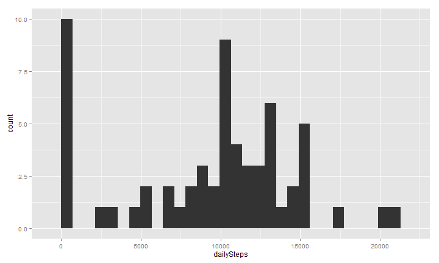
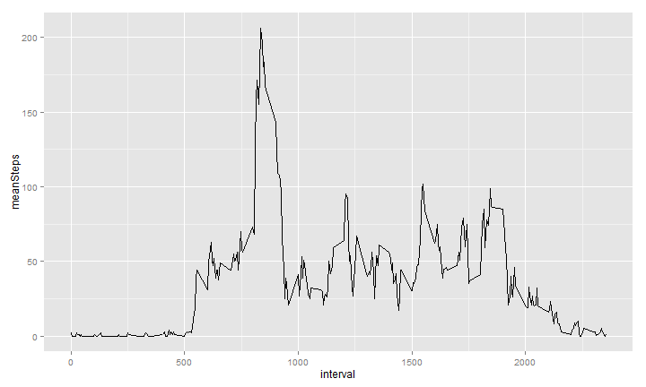
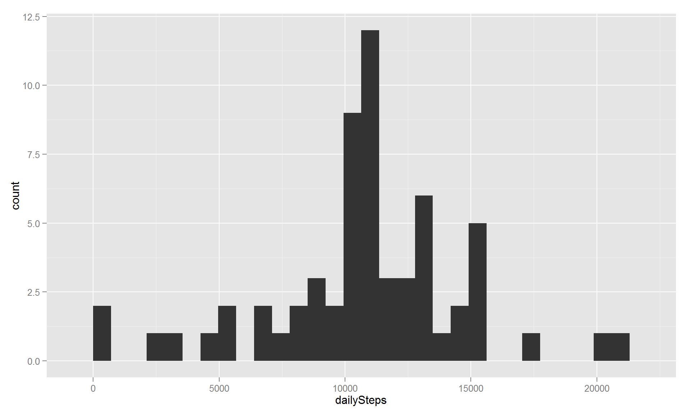
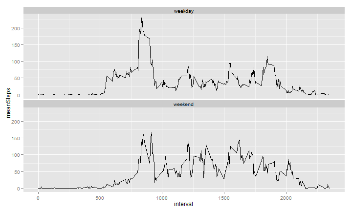

# Reproducible Research: Peer Assessment 1
author: "David Parker"  
date: "Friday, August 15, 2014"  
output: html_document  

## Loading and preprocessing the data

```r
library(plyr)
library(ggplot2)
library(timeDate)
library(knitr)
opts_knit$set(progress = FALSE)
opts_chunk$set(echo = TRUE, message = FALSE, tidy = TRUE, comment = NA, fig.path = "figure/", 
    fig.keep = "high", fig.width = 10, fig.height = 6, fig.align = "center")
activity <- read.csv("activity.csv", colClasses = c("integer", "Date", "integer"), 
    stringsAsFactors = FALSE)
activity$date <- as.POSIXlt(activity$date, tz = "", "%Y%m%d")
```

Display head, tail, and summary stats:  

```r
rbind(head(activity, 3), tail(activity, 3))
```

```
      steps       date interval
1        NA 2012-10-01        0
2        NA 2012-10-01        5
3        NA 2012-10-01       10
17566    NA 2012-11-30     2345
17567    NA 2012-11-30     2350
17568    NA 2012-11-30     2355
```

```r
summary(activity)
```

```
     steps            date               interval   
 Min.   :  0.0   Min.   :2012-10-01   Min.   :   0  
 1st Qu.:  0.0   1st Qu.:2012-10-16   1st Qu.: 589  
 Median :  0.0   Median :2012-10-31   Median :1178  
 Mean   : 37.4   Mean   :2012-10-31   Mean   :1178  
 3rd Qu.: 12.0   3rd Qu.:2012-11-15   3rd Qu.:1766  
 Max.   :806.0   Max.   :2012-11-30   Max.   :2355  
 NA's   :2304                                       
```


## What is mean total number of steps taken per day?

```r
actDaily <- ddply(activity, .(date), summarize, dailySteps = sum(steps, na.rm = TRUE), 
    meanInt = round(mean(steps, na.rm = TRUE), 0))
```

*Histogram* of *average* daily *steps*:  

```r
ggplot(actDaily, aes(x = dailySteps)) + geom_histogram(binwidth = 710)
```



*Mean* daily *steps*:  

```r
round(mean(actDaily$dailySteps, na.rm = TRUE), 0)
```

```
[1] 9354
```

*Median* daily *steps*:  

```r
round(median(actDaily$dailySteps, na.rm = TRUE), 0)
```

```
[1] 10395
```


## What is the average daily activity pattern?
Calculate the *mean* *steps* for each *interval*:  

```r
actInterval <- ddply(activity, .(interval), summarize, meanSteps = round(mean(steps, 
    na.rm = TRUE), 0))
```

Merge the *mean* *steps* for each *interval* with the *activity* data frame:  

```r
actMerge <- join(x = activity, y = actInterval, by = "interval")
```

Plot of the 5-minute interval and the average number of steps taken, averaged across all days:  

```r
ggplot(actMerge, aes(x = interval, y = meanSteps)) + geom_line()
```



Five minute *interval* across all days with the **most** steps:  

```r
actMerge[which.max(actMerge$steps), c("steps", "date", "interval")]
```

```
      steps       date interval
16492   806 2012-11-27      615
```


## Imputing missing values  
*Total* number of rows with **missing** values is:  

```r
nrow(activity) - nrow(na.omit(activity))
```

```
[1] 2304
```
This number agrees with the NA's shown in summary from step 1.  

Now to fill in the missing values using the mean of steps for said interval.  
The mean steps is caculated in *actMerge* data frame replacing *NA*'s with average *steps* per *interval*. Simply need to write this data back to the *activity* data frame.  


```r
actMerge[which(is.na(actMerge$steps)), ]$steps <- actMerge[which(is.na(actMerge$steps)), 
    ]$meanSteps
activity <- actMerge[, c("steps", "date", "interval")]
```

Recompute the *mean* and *median* daily *steps* with imputed values.  

```r
actDaily <- ddply(activity, .(date), summarize, dailySteps = sum(steps, na.rm = TRUE), 
    meanInt = round(mean(steps, na.rm = TRUE), 0))
```

Histogram of *daily steps* using imputed values:  

```r
ggplot(actDaily, aes(x = dailySteps)) + geom_histogram(binwidth = 710)
```




Mean daily *steps*:  

```r
round(mean(actDaily$dailySteps, na.rm = TRUE), 0)
```

```
[1] 10766
```

Median daily *steps*:  

```r
round(median(actDaily$dailySteps, na.rm = TRUE), 0)
```

```
[1] 10762
```

The impact of imputing missing data was to produce values and plots that were more inline with average steps values. This makes sense due to the fact that I computed mean steps for corresponding intervals for the missing values. The estimates for mean and median and resulting histogram were inline with the averages.  

## Are there differences in activity patterns between weekdays and weekends?  

Using dataset with imputed missing values recalculate the average steps taken each day:  

```r
actInterval <- ddply(activity, .(interval), summarize, meanSteps = round(mean(steps, 
    na.rm = TRUE), 0))
actMerge <- join(x = activity, y = actInterval, by = "interval")
```


Compute a *wkday* factor variable consisting of either *weekday* or *weekend* values.  


```r
activity$wkday <- factor(ifelse(isWeekday(activity$date), paste("weekday"), 
    paste("weekend")))
actIntDay <- ddply(activity[activity$wkday == "weekday", ], .(interval), summarize, 
    meanSteps = round(mean(steps, na.rm = TRUE), 0))
actIntEnd <- ddply(activity[activity$wkday == "weekend", ], .(interval), summarize, 
    meanSteps = round(mean(steps, na.rm = TRUE), 0))
actMergDay <- join(x = activity, y = actIntDay, by = "interval")
actMergEnd <- join(x = activity, y = actIntEnd, by = "interval")
actMerge <- rbind(actMergDay[actMergDay$wkday == "weekday", ], actMergEnd[actMergEnd$wkday == 
    "weekend", ])
```

Plot of the 5-minute interval and the average number of steps taken, averaged across all days  using *wkday* factor as the facet, wrapping on rows:  

```r
ggplot(actMerge, aes(x = interval, y = meanSteps)) + geom_line() + facet_wrap(~wkday, 
    nrow = 2)
```


  
The patterns were very similar with the weekend showing a more "relaxed" appearance which would seem to be expected.  
